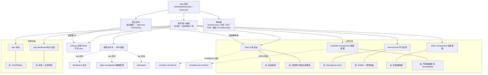

# Deep Student 移动端 UI/UX 场景地图与走查路线图（2026-07-05）

> 方法：4 路并行代码调研（全局壳层 / ChatV2 / Learning Hub / 待办·技能·制卡·模板），
> 从源码枚举 `isSmallScreen`（<768px，实测窗口 400×880）下所有可达页面、状态与动作分支。
> 用途：作为人工逐节点走查的路线图。走查时在复选框打勾，问题记录到「发现」列。

---

## 一、总场景树（导航层）

关键机制（走查时须验证的全局行为）：

- **视图保活**：touch 设备 LRU 上限 4 个非 pinned 视图；被逐出的视图再进入时状态可能丢失。
- **返回键优先级**：overlay（Dialog/命令面板/抽屉/图片查看器）→ 页面历史 → 应用退后台。
- **手势**：三屏页边缘 20px 起手、位移 30% 或 fling 切屏；PDF/编辑器/导图区域豁免。
- **设置**：移动端是全屏 Sheet，`currentView` 不变——顶栏仍显示底层页配置。

---

## 二、逐页动作分支清单（走查 checklist）

打勾规则：✅ 走查通过；⚠️ 有问题（记录到第三节）；➖ 无法构造前置条件（注明）。

### A. 全局壳层 / 系统级

| # | 场景 | 动作 | 预期 | 走查 |
|---|------|------|------|------|
| A1 | 首次启动 | 协议弹窗 → 同意 | 进入主壳 | [ ] |
| A2 | Onboarding | 「去配置 AI」/「先随便看看」 | 开设置 Sheet(apis) / 关闭 | [ ] |
| A3 | 任意页 | 抽屉「搜索与命令」 | 关抽屉 + 开命令面板 | [ ] |
| A4 | 命令面板 | Escape / Android back / 执行命令 | 关闭 | [ ] |
| A5 | 命令面板 | nav 到 dashboard / data-management / pdf-reader | 能进入且**能返回**（这些页无抽屉入口） | [ ] |
| A6 | 任意三屏页抽屉开 | Android back | 回 center，不退应用 | [ ] |
| A7 | 根视图无浮层 | Android back | 应用退后台（非崩溃） | [ ] |
| A8 | 任意页 | 边缘右滑 / 左滑 | 开抽屉 / 开右屏（有右屏时） | [ ] |
| A9 | 视图崩溃 | ErrorBoundary | 单视图降级 + 重试按钮，其他页可用 | [ ] |
| A10 | DEV FAB | 拖动 / 热重载 / 重置导航 / DevTools | 各动作生效（注：重置导航事件仅 LH 监听） | [ ] |
| A11 | 键盘弹出时 | 点抽屉导航 | 导航被屏蔽（防误触）——验证收起键盘后可导航 | [ ] |
| A12 | 5+ 页访问后 | 回到最早访问页 | LRU 逐出后重挂载，验证状态是否可接受 | [ ] |

### B. ChatV2（三屏）

| # | 场景 | 动作 | 预期 | 走查 |
|---|------|------|------|------|
| B1 | center | 顶栏 ☰ / 边缘右滑 | 左抽屉开 | [ ] |
| B2 | 左抽屉 | 新对话 | 建会话 + 关抽屉 | [ ] |
| B3 | 左抽屉 | 点会话条目 | 切会话（注意：**不关抽屉**，确认是否合理） | [ ] |
| B4 | 会话条目 | 触屏 … 菜单 | 重命名 / 置顶 / 归档（**无删除** — 见 F2） | [ ] |
| B5 | 左抽屉 | 已归档会话 | 跳设置页归档列表，可返回 | [ ] |
| B6 | 课题分区 | 折叠/展开文件夹 | 正常；文件夹内加号触屏不可见（见 F3） | [ ] |
| B7 | center | `CHAT_TOGGLE_PANEL`（附件菜单「学习资源库」）/ 边缘左滑 | 右屏资源库开 | [ ] |
| B8 | 右屏资源库 | 点资源 → 全屏应用面板 → X 关闭 | 回 center | [ ] |
| B9 | 右屏 | 顶栏返回 / 手势滑回 | 回 center | [ ] |
| B10 | 输入栏 | + 菜单：添加附件 / 资源库 / 相机 | 三分支各自生效 | [ ] |
| B11 | 输入栏 | 技能按钮 → 面板选技能 → 再点清除 | 开面板 / 清空已选 | [ ] |
| B12 | 输入栏 | 对话控制面板（温度/TopP/RAG 参数） | 可调；流式中禁用 | [ ] |
| B13 | 输入栏 | 推理深度菜单 | 可切换；不支持的模型 disabled | [ ] |
| B14 | 输入栏 | 语音输入 | 录音开始/结束 | [ ] |
| B15 | 空输入 | 点发送 disabled 遮罩 | toast 说明原因 | [ ] |
| B16 | 流式中 | 停止按钮 / textarea readOnly | 中断生成 | [ ] |
| B17 | 消息 | 常显复制 + … 菜单：重试/保存笔记/分支/删除 | 各分支生效；删除有确认 | [ ] |
| B18 | 用户消息 | … 菜单 | **无编辑入口**（见 F4），验证重发可用 | [ ] |
| B19 | 消息特殊块 | 思考块/工具块展开、Anki 面板 Sheet、代码块沙箱 | 展开收起正常；沙箱进右屏 | [ ] |
| B20 | 沙箱右屏 | 关闭 | 回 center，不残留 right（见 F5） | [ ] |
| B21 | composer 面板开 | Android back | 先关面板再关抽屉 | [ ] |
| B22 | 顶栏 + | 空会话时 | disabled；有消息后可新建 | [ ] |

### C. Learning Hub（三屏）

| # | 场景 | 动作 | 预期 | 走查 |
|---|------|------|------|------|
| C1 | 左抽屉 | 桌面/全部文件/最近/收藏/各资源类型/图片/文档/回收站/向量化/记忆 | 各进对应中屏视图 | [ ] |
| C2 | 左抽屉 | 搜索框输入 | **已知未接线**（见 F6）确认现象 | [ ] |
| C3 | 左抽屉 | + → 新建文件夹 | **已知未接线**（见 F6）确认现象 | [ ] |
| C4 | 左抽屉 | + → 新建笔记/题目集/翻译/作文/导图 | 创建 + 直接开右屏 | [ ] |
| C5 | 中屏 Finder | 触屏单击文件夹 / 文件 | 进文件夹 / 开右屏预览 | [ ] |
| C6 | 子文件夹 | 顶栏面包屑 / 返回箭头 | 逐级返回；根级恢复 ☰ | [ ] |
| C7 | Finder 工具栏 | 搜索展开 → 输入 → 清除 | 防抖过滤生效 | [ ] |
| C8 | Finder 工具栏 | + 菜单：新建文件夹/笔记/导入 MD/题目集/导入教材/翻译/作文/导图 | 各分支生效 | [ ] |
| C9 | 文件项 | 触屏 … 菜单：打开/复制/移动/重命名/收藏/加桌面/导出/删除 | 各分支；导出应提示移动端不支持 | [ ] |
| C10 | 底部批量栏 | 多选开关 → 全选 → 添加到聊天 / 移动 / 删除 | 各分支；无会话时添加到聊天的行为 | [ ] |
| C11 | 底部批量栏 | 列表/网格切换、排序菜单 | 生效且持久 | [ ] |
| C12 | PDF 预览 | 缩放/翻页/搜索/高亮/书签/选页送聊天 | 工具栏 compact 模式可用；手势不与三屏冲突 | [ ] |
| C13 | 笔记预览 | 编辑自动保存；侧栏按钮 → Sheet 大纲 | 正常 | [ ] |
| C14 | 图片/office 预览 | 缩放/旋转/下载 | 正常 | [ ] |
| C15 | 右屏 TabBar | 多 tab 切换 / 关闭当前 / 关闭全部 | 关最后一个自动回 center | [ ] |
| C16 | 回收站 | 恢复 / 永久删除 / 清空 | 各有确认 | [ ] |
| C17 | 向量化状态 | 重新索引 / 批量操作 / 筛选 | 触屏按钮常显 | [ ] |
| C18 | 记忆 | 无根文件夹引导 / 有根文件夹 Finder + 树状图 | 两分支 | [ ] |
| C19 | 桌面视图 | 空态 CTA 添加快捷方式 / 点击快捷方式 | 生效；重命名/删除触屏无入口（见 F7） | [ ] |
| C20 | 收藏/最近 | 列表打开 / 失效项自动清理 | 正常 | [ ] |

### D. 待办（两屏）

| # | 场景 | 动作 | 预期 | 走查 |
|---|------|------|------|------|
| D1 | 抽屉 | 收件箱/今日/即将到期/四象限/已过期/已完成 | 切视图 + 关抽屉；**四象限顶栏标题**（见 F8） | [ ] |
| D2 | 抽屉 | 清单搜索 / 新建清单 +（hover 依赖，见 F9） | 触屏能否新建 | [ ] |
| D3 | 抽屉 | 双击重命名 / 收藏 / 删除清单（hover 依赖） | 触屏能否操作 | [ ] |
| D4 | 抽屉 | 回收站 → 恢复/永久删除/清空 | Dialog 各分支 | [ ] |
| D5 | 主区 | QuickAdd `明天交作业 !高 #标签` | chip 预览 + 创建正确 | [ ] |
| D6 | 智能视图 | QuickAdd 是否可见 | **仅清单视图有**——确认智能视图无法快速添加是否可接受 | [ ] |
| D7 | 任务行 | 圆圈完成 / 点行开详情 | 完成切换；移动端全屏详情 overlay | [ ] |
| D8 | 任务行 | 改期 / 删除 / 开始专注（触屏 60% 透明度） | 可点性与可发现性 | [ ] |
| D9 | 详情 overlay | 编辑标题/日期/优先级/重复/标签/子任务/AI 拆解/删除 | 各分支；X 与 Android back 均可关 | [ ] |
| D10 | 子任务 | 删除按钮（hover 依赖，见 F9） | 触屏能否删除 | [ ] |
| D11 | 番茄钟 | 开始/暂停/继续/停止/跳过休息/严格模式 | 状态机正确 | [ ] |
| D12 | 番茄钟 | 环境音开关 / 设置 / 统计 / 沉浸模式 | 各面板开关正常；沉浸模式能退出 | [ ] |
| D13 | 手动排序 | 长按拖拽顶层任务 | 生效且不与滚动冲突 | [ ] |
| D14 | 搜索 | 输入 → 结果 → 清空 | 防抖 + 恢复视图 | [ ] |

### E. 技能 / 制卡 / 模板

| # | 场景 | 动作 | 预期 | 走查 |
|---|------|------|------|------|
| E1 | 技能列表 | 筛选 Tab / 搜索 / 导入 .md / 导出全部 | 各分支；冲突覆盖确认 | [ ] |
| E2 | 技能卡片 | 默认启用 pill / 收藏 / 编辑 / … 菜单 | 内置无删除但有恢复默认 | [ ] |
| E3 | 技能编辑器（右屏） | 三 Tab 编辑 → 保存 / 取消（脏数据确认）/ 顶栏返回 / 手势滑回 | 四种退出路径都正常 | [ ] |
| E4 | 制卡任务 | 筛选/搜索/排序循环/刷新/恢复卡住 | 各分支 | [ ] |
| E5 | 制卡空态 | 「去聊天发起制卡」 | 切到 chat-v2 新会话 | [ ] |
| E6 | 任务行 | 展开 → 暂停/恢复/重试失败/行内导出/跳聊天/删除（两击确认） | 各分支（需有任务数据，无则 ➖） | [ ] |
| E7 | 制卡 | 「管理模板」 | 切模板页；模板页面包屑「Anki制卡」可返回 | [ ] |
| E8 | 模板浏览 | 点卡片选中 / 设默认 / 编辑 / 复制 / 导出 / 删除 | 各分支；内置删除的前端表现（见 F10） | [ ] |
| E9 | 模板侧栏 | 导入内置 / 导入外部 JSON / 批量导出 | Dialog 各分支 | [ ] |
| E10 | 模板编辑 | basic/data/rules/advanced Tab | 单屏滚动可编辑保存 | [ ] |
| E11 | 模板代码模式 | 「模板代码」→ 三屏右屏 CodeMirror front/back/css | 编辑生效；切走强制回 center | [ ] |
| E12 | 设置 Sheet | 从任意页抽屉进 → 顶部 chip 切 11 个 Tab → X 关闭 | 完整轮巡；关闭回原页 | [ ] |
| E13 | 设置 Sheet | Sheet 上叠 Dialog（API 编辑/供应商） | 关 Dialog 不误关 Sheet；Android back 顺序 | [ ] |

---

## 三、静态分析发现的不闭环嫌疑（走查重点验证）

| 编号 | 页面 | 嫌疑 | 来源 |
|------|------|------|------|
| F1 | 壳层 | dashboard / data-management / pdf-reader / sandbox / template-json-preview **无抽屉入口**，且部分无 showMenu 无返回——进去后可能出不来 | App.tsx |
| F2 | Chat | 左抽屉会话菜单**无删除**；有删除的 SessionBrowser（viewMode='browser'）**无任何入口** | SessionSidebarContent / ChatV2Page |
| F3 | Chat | 课题文件夹加号 `group-hover` 触屏不可见；左抽屉无搜索框 | SessionSidebarContent |
| F4 | Chat | 移动端用户消息 compact 菜单**无编辑** | MessageActions |
| F5 | Chat | 沙箱开时手势滑回只清 mobileResourcePanelOpen，可能滞留 right；`⌘⇧K` RAG 面板 UI 已删但快捷键仍在 | ChatV2Page / InputBarUI |
| F6 | LH | 左抽屉搜索框、新建文件夹回调未接线（onSearchChange/onNewFolder 未传） | DstuAppLauncher |
| F7 | LH | 桌面快捷方式重命名/删除、空白区菜单仅右键，触屏无替代；单文件「引用到对话」未接线 | DesktopView / ContextMenu |
| F8 | 待办 | 四象限视图顶栏标题未映射（显示清单名/收件箱） | TodoContentView |
| F9 | 待办 | 新建清单+、清单收藏/重命名/删除、子任务删除依赖 hover；任务行操作触屏 60% 透明 | TodoSidebar / TodoMainPanel |
| F10 | 模板 | 内置模板删除按钮前端未禁用（依赖后端拒绝） | TemplateManagementPage |
| F11 | 壳层 | Settings Sheet 打开时顶栏仍显示底层页标题/按钮 | App.tsx |
| F12 | 壳层 | 命令面板无 todo / sandbox 导航命令；DEV FAB「重置导航」事件无全局监听 | navigation.commands / DevMobileRecoveryFab |

### G. 横切维度（每项抽 2–3 个代表页面验证）

| # | 维度 | 验证方式 | 走查 |
|---|------|----------|------|
| G1 | 深色主题 | 设置→外观切暗色，抽查 Chat 抽屉 / 设置 Sheet / 弹层对比度与遮罩 | [ ] |
| G2 | 语言 en-US | 切英文，抽查顶栏标题、抽屉导航、按钮文案溢出/换行 | [ ] |
| G3 | 软键盘 | 待办详情、技能编辑器、设置表单聚焦输入 → 输入框不被键盘遮挡 | [ ] |
| G4 | 无 API Key | 清空/禁用配置后发消息 → 错误提示是否引导去设置（闭环） | [ ] |
| G5 | 请求失败/离线 | 断网发消息 / 加载列表 → 每页错误态与恢复 | [ ] |
| G6 | 长内容 | 超长会话标题、深层文件夹面包屑、长文件名截断 | [ ] |
| G7 | 大数据量 | 30+ 会话 / 50+ 文件 / 50+ 待办时滚动与性能 | [ ] |
| G8 | safe-area | 底部输入栏/批量栏与 home indicator 间距（模拟 env inset） | [ ] |
| G9 | 重启恢复 | 重启应用 → 会话/当前视图/PDF 阅读进度是否恢复 | [ ] |

### H. 入口已测但内部未测的页面

| # | 页面 | 内部功能 | 走查 |
|---|------|----------|------|
| H1 | 设置·模型服务 | 供应商增删、API Key 编辑、测试连接、获取模型列表、一键分配 | [ ] |
| H2 | 设置·模型分配 | 各用途模型指派 | [ ] |
| H3 | 设置·数据治理 | 备份/恢复/导出 ZIP（破坏性操作确认流程） | [ ] |
| H4 | 设置·快捷键/搜索/MCP/统计/参数/关于 | 逐 Tab 内部可用性 | [ ] |
| H5 | 已归档会话管理（设置内） | 列表、恢复、删除、返回聊天 | [ ] |
| H6 | dashboard 总览 | 页内卡片/链接是否可用；返回途径 | [ ] |
| H7 | data-management | 导入/导出流程、进度、失败态 | [ ] |
| H8 | sandbox-workbench | 工作台内部（预览/文件/关闭）；独立 pdf-reader、template-json-preview | [ ] |

### I. 端到端核心流程

| # | 流程 | 链路 | 走查 |
|---|------|------|------|
| I1 | 真实对话 | 发送 → 流式 → 完成 → 复制/重试/分支；流式中停止 | [ ] |
| I2 | 流式排队 | 生成中继续输入发送 → 队列行为 | [ ] |
| I3 | 附件生命周期 | 选文件 → 上传中态 → 移除 → 带附件发送 → 消息内预览 | [ ] |
| I4 | ChatAnki 制卡 | 聊天发起制卡 → Anki 面板 Sheet → 卡片编辑/导出 → 制卡任务页出现任务并可操作 | [ ] |
| I5 | RAG 闭环 | 导入教材 → 向量化状态确认 → 聊天引用 → 来源卡片跳回预览 | [ ] |
| I6 | 课题流程 | 新建课题 → 右屏选资源 pin → 课题下建会话 | [ ] |
| I7 | 四 app 内部 | exam 答题/translation 设置/essay 批改/mindmap 触屏编辑与捏合缩放 | [ ] |
| I8 | 多模型对比 | @模型 / 对比模式 → 移动端多变体垂直布局操作 | [ ] |

### J. 系统边缘

| # | 场景 | 动作 | 走查 |
|---|------|------|------|
| J1 | 迁移失败横幅 | 「查看详情/复制日志/稍后处理」三按钮各自行为（实测已出现过） | [ ] |
| J2 | 通知 toast | action 按钮、多条堆叠、hover 暂停、手动关闭 | [ ] |
| J3 | 消息长按 | 文本选择与复制（WebView 行为） | [ ] |
| J4 | 快速连点 | 发送/删除/导出双击防抖 | [ ] |
| J5 | PDF 捏合 | 双指缩放与三屏手势不冲突 | [ ] |
| J6 | 维护横幅 | 「查看详情」→ 设置对应 Tab | [ ] |

---

## 四、走查执行顺序（建议）

1. **A 壳层**（A1–A12）：先验证全局机制，后面页面走查复用结论。
2. **B Chat**（核心高频页）→ 顺带验证 F2–F5、J1–J4。
3. **C Learning Hub**（分支最多）→ 顺带 F6–F7、J5；PDF/笔记预览需先造 1 个教材 + 1 篇笔记。
4. **D 待办** → 顺带 F8–F9；造 2 个清单 + 若干任务。
5. **E 技能/制卡/模板/设置** + **H 设置内部/隐藏页**（H1–H8）→ 顺带 F10–F11。
6. **I 端到端流程**（I1–I8）：需 API Key 与真实数据，放在单页走查之后集中做。
7. **G 横切维度**（G1–G9）：暗色/英文/键盘/无 Key/离线等，抽样回归代表页面。
8. 汇总：⚠️ 项归并为 P0/P1/P2 修复清单。

走查工具：`npm run ui:lab` + `node scripts/dev/ui-drive.mjs`（click/eval/shot/swipe/back），每步截图人工读图确认，不使用批量审计脚本打分。
