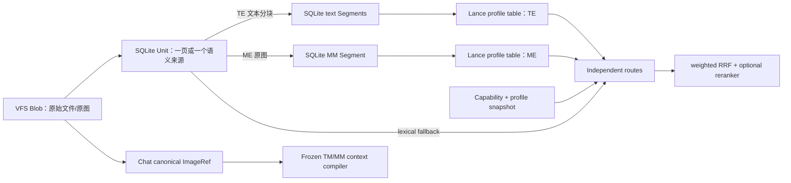

# VFS 向量与多模态知识库评估、加固和后续优化

更新日期：2026-07-14

## 1. 结论

本轮改造前，Deep Student 已具备 SQLite VFS、Blob、LanceDB、文本向量、
多模态向量和跨维度搜索的基本能力，但“维度”被错误地当成了向量空间身份，
索引元数据与 Lance 行之间缺少可提交的代际协议，跨空间结果直接比较原始分数，
多模态索引又混合了原图与 OCR 文本。这些问题在模型换绑、同维度不同模型、
并发重建、失败重试、目录移动和 TM/MM 切换时会产生错误召回、短暂空窗、
陈旧向量或不可恢复的降级。

改造后的主线设计是：

1. 以 `IndexProfile` 而不是维度标识向量空间。
2. 以 SQLite 的 Unit/Segment 账本作为可见性真相，LanceDB 作为可重建派生索引。
3. 以 per-Unit generation 完成“先写新向量、再原子激活、最后回收旧向量”。
4. 文本、图片和不同模型空间独立召回，使用 weighted RRF 融合，不比较跨空间原始分数。
5. ME 始终编码原图；OCR 是纯文本模型的视觉降级，不是 ME 或 MM 的前置步骤。
6. 聊天保存稳定的 Blob 引用，每轮冻结模型和能力快照，因此 TM/MM 可任意交替。

该方案保留了 LanceDB 对本地桌面应用的低运维优势，同时补上了 Qdrant、Milvus、
Weaviate 一类服务端向量库通常由 collection/named-vector schema 提供、但嵌入式
LanceDB 不会替应用自动管理的模型空间与生命周期语义。

## 2. 改造前的主要问题

### 2.1 向量空间身份错误

- Lance 表仅按 `modality + dimension` 命名。同样是 1024 维的两个模型会写入同一表，
  但“维度相同”不代表坐标系相同。
- `vfs_embedding_dims` 只能保存一个可变的模型绑定。换绑后旧向量仍在，查询却使用
  新模型生成 query vector，结果在数学上无意义。
- 模型显示名曾被当作实际模型名参与绑定，无法可靠识别模型配置的真实变化。
- 文本和多模态 embedding/reranker 的能力边界主要依赖前端过滤，IPC 或历史配置仍可
  形成协议错配。

### 2.2 索引一致性与恢复不足

- SQLite Segment 与 Lance 行不是同一个事务；删除、重建或崩溃可能留下孤儿行。
- 稳定 row ID 在强制重建时会覆盖旧行，SQLite 尚未切换就可能出现读空窗。
- generation 曾被误建模为 profile 全局值；实际上不同 Unit 会处于不同代。
- 失败达到 `max_retries` 后可能永久不再处理，孤儿删除队列也可能永久滞留。
- 空文本、页数减少、目录移动、模型切换和恢复备份后的重建语义不完整。
- `record_count` 依赖增减计数，补偿失败后容易漂移。

### 2.3 检索质量与路由问题

- 旧跨维度搜索把不同模型空间的 raw cosine score 直接排序。
- 文本、图片、多模态和不同维度没有统一的 route planner；部分入口只查询默认维度。
- 一个 embedding API 失败可能拖垮整次检索，失败路线缺少结构化 provenance。
- Lance 的旧 `Index::Auto` 可能按 L2 建 ANN，而查询显式使用 Cosine。
- `folder_id` 是写入 Lance 时的缓存，目录移动后在 Lance 内先过滤会漏掉正确结果。
- 没有 TE 时，未生成 Segment 的 Unit 文本也可能失去 lexical fallback。
- 纯文本候选和含图候选没有稳定地选择对应的 text/VL reranker。

### 2.4 多模态语义错误

- 原实现可把 OCR 文本与图片拼成 ME 输入，使图片空间依赖 OCR 是否存在及 OCR 版本。
- 图片页没有完整的一页一 Unit/Segment 账本，删除与重建无法复用文本侧一致性协议。
- `blob_hash` 曾从错误字段推导，检索结果可能无法回到真实原图。
- 多模态搜索入口只走当前默认模型，不能覆盖 rolling 期间的多个 queryable profile。

### 2.5 Chat 中 TM/MM 切换不闭合

- 历史消息主要保存临时 Base64/格式化预览，模型切换后不一定能重新获得原图。
- Active TM 遇到图片时，辅助 MM 与 OCR 的优先级没有统一契约。
- Active MM 可能仍收到 OCR 派生文本，而不是直接接收文本与原图。
- UI 在一次生成期间切换模型时，执行中的请求缺少不可变快照。
- 多变体可能共享已编译上下文，而各模型的图片能力实际不同。

## 3. 最终架构与不变量

必须长期保持以下不变量：

1. 向量空间身份不能由维度推断。
2. `IndexProfile = fingerprint + dimension + modality + protocol + schema_version`。
3. fingerprint 至少包含 `config_id + actual model_name + protocol`。
4. 一批 Lance 写入只能属于一个 profile、一个维度，并带非空 `unit_id` 和 generation。
5. SQLite Unit 当前的 `profile_id + generation` 决定可见性；profile 不存在全局当前 generation。
6. 新 Lance 行先写入；SQLite Unit/Segment 原子切换后，旧行才允许删除。
7. 删除 SQLite Segment 前先持久化 Lance 删除意图；快删失败由队列继续重试。
8. ME 只接收原图。OCR/native text 是独立 Unit 派生物。
9. Active MM 接收文本与原图，不以 OCR 为前置条件。
10. Active TM 有图片时优先 `MM 观察 -> TM`，辅助 MM 不可用或调用失败才 `OCR -> TM`。
11. 跨空间融合只使用 rank/provenance，不比较 raw score。
12. `folder_items` 是目录成员关系真相；Lance `folder_id` 仅是派生缓存。
13. 一个 route 超时或失败只产生 route failure，不抹掉其他成功路线。
14. 每轮 Chat 的模型、能力、规划路线和实际路线均冻结并持久化。

## 4. 32 个能力子集的完整回退

五个能力位为：

- TE：文本嵌入
- ME：多模态嵌入
- TM：纯文本语言模型
- MM：可同时输入文本和图片的多模态语言模型
- OCR：OCR 引擎

TE/ME 决定直接候选路线；TM/MM/OCR 决定生成路线，同时 MM/OCR 还可在所有
ME-image 路线失败或空召回后，为图片检索派生文本查询。因此 32 个子集仍可用下面
`4 × 8` 的矩阵完整描述，但两部分通过“条件式图片查询派生”连接，代码测试遍历所有 mask。

### 4.1 检索子集（TE/ME）

| TE | ME | 文本查询 | 图片查询 | 图文混合查询 |
|---:|---:|---|---|---|
| 0 | 0 | lexical/FTS | MM 观察或 OCR 派生后 lexical；均无则无语义路线 | 原文本 lexical；可追加图片派生 lexical |
| 1 | 0 | lexical + TE | MM 观察或 OCR 派生后 lexical + TE；均无则无语义路线 | 原文本 lexical + TE；可追加图片派生路线 |
| 0 | 1 | lexical + ME(text) | 先 ME(image)；全部失败/空结果才派生 lexical | lexical + ME(text) + ME(image)，图片空召回时追加派生 lexical |
| 1 | 1 | lexical + TE + ME(text) | 先 ME(image)；全部失败/空结果才派生 lexical + TE | 四路独立召回；图片空召回时追加派生 lexical + TE |

图片查询的派生顺序固定为 `ME(image) -> MM 原图观察 -> OCR`。MM 与 OCR 只生成查询文本，
不是知识库候选路线；派生后的文本仅检索 lexical/TE，不用合成文本重试已失败的 ME 空间。
图文混合未来可增加 `ME(text+image)` 联合向量路线，但当前拆分后 RRF 能在单模态失败时
保留另一模态，故稳定性更高。

### 4.2 生成子集（TM/MM/OCR）

| TM | MM | OCR | 纯文本 | 图片且 Active TM | 图片且 Active MM |
|---:|---:|---:|---|---|---|
| 0 | 0 | 0 | 不可生成 | 不可生成 | 不可生成 |
| 0 | 0 | 1 | 不可生成 | 不可生成；OCR 单独不能回答 | 不可生成 |
| 0 | 1 | 0 | MM direct | 请求 TM 时回退 MM direct | MM 原图 direct |
| 0 | 1 | 1 | MM direct | 请求 TM 时回退 MM direct | MM 原图 direct；不用 OCR |
| 1 | 0 | 0 | TM direct | TM 无视觉降级回答 | 请求 MM 时回退 TM，无视觉 |
| 1 | 0 | 1 | TM direct | OCR -> TM | 请求 MM 时 OCR -> TM |
| 1 | 1 | 0 | 当前选中的 TM/MM direct | MM 视觉观察 -> TM | MM 原图 direct |
| 1 | 1 | 1 | 当前选中的 TM/MM direct | MM 视觉观察 -> TM；失败再 OCR -> TM | MM 原图 direct；不用 OCR |

“可用”不仅表示配置存在，还要求 enabled、能力标记、协议和索引兼容。检索路线独立超时；
辅助 MM/OCR 的运行时失败按上表继续降级。主生成模型的 provider failover 必须保持输入能力
兼容，不能把已经按 MM 原图编译的请求静默切给 TM。System OCR 是 native OCR candidate，
不是伪造的模型配置；支持该能力的平台默认可用，显式禁用后才从候选链移除。

## 5. TM/MM 任意顺序切换

Chat 持久化的 canonical part 包括：

- `Text`
- `ImageRef`（resource/source/blob/content hash，不保存临时 Base64）
- `FileRef`
- `CitationRef`
- `DerivedArtifactRef`（视觉观察或 OCR 文本）

每一轮按如下顺序处理：

1. 冻结 requested/resolved model、TM/MM/OCR 能力、图片预算和 generation plan。
2. 从 VFS Blob 重新加载 canonical 原图；canonical bytes 覆盖压缩 preview Base64。
3. Active MM：保留预算内原图，文本和图片直接送 MM，不调用 OCR。
4. Active TM：优先调用辅助 MM 产生视觉观察；失败或不存在才逐图 OCR；最后移除图片。
5. 将实际 route 与本轮 derived artifact 持久化，但始终保留原始 `ImageRef`。

因此以下顺序都闭合：

- `TM -> MM`：后续 MM 从 Blob 重新获得原图，不会被上一轮 OCR/观察替代。
- `MM -> TM`：后续 TM 基于同一原图生成辅助观察或 OCR。
- `TM -> MM -> TM`：原图始终存在；TM 可复用与同一图片关联的已保存观察。
- 多变体：每个 variant 独立冻结和编译；用户消息只保存 canonical refs，variant meta 保存各自快照。

## 6. 与其他项目的对比

| 项目 | 多空间/多向量能力 | 融合与排序 | 本地桌面适配 | 对 Deep Student 的启示 |
|---|---|---|---|---|
| LanceDB | 同一 dataset 可建多个 vector index；支持 IVF/HNSW、hybrid search、RRF 和 multivector/MaxSim | 原生 hybrid 默认可用 RRF，也可接 reranker | 很适合嵌入式、本地优先 | 存储合适，但 model profile、SQLite 可见性和 Chat 能力必须由应用层补齐 |
| Qdrant | named vectors、dense/sparse、multivector/late interaction | Query API 支持嵌套 prefetch、RRF 等融合 | 需要独立服务时运维更重 | 本轮 unified routes + RRF 与其 query DAG 思路接近 |
| Milvus | collection 内多个 vector field，可并行多个 ANN | Weighted/RRF ranker 与 hybrid search | 面向大规模分布式，桌面过重 | 证明跨模态应先独立 ANN，再用 ranker 融合 |
| Weaviate | named vectors 和 multi-target search | min/sum/average/manual/relative score join | 集成能力强但需服务与 schema 管理 | raw distance join 仅在可校准时使用；异构模型更适合 RRF |
| Vespa | tensor field、多个 nearest-neighbor 与强 ranking profile | 可编写复杂多阶段在线排序 | 运维和学习成本最高 | 若未来需要业务特征+向量的深度排序，可借鉴 ranking profile |
| Chroma | OpenCLIP 支持 text/image 同空间；原图用 URI/data loader，不直接存库 | 基础向量检索 | Python 本地开发简单 | canonical Blob + loader 思路一致；本项目的事务和生命周期更严格 |
| pgvector | 多列可保存多个空间，HNSW/IVFFlat 支持显式 distance ops | SQL 可自定义融合，但需应用实现 | 若已有 PostgreSQL 很合适；桌面内嵌较重 | 再次说明 ANN index metric 必须与查询 metric 完全一致 |
| LlamaIndex | 示例使用独立 text/image index 并同时检索 | 在 retriever/orchestrator 层合并 | 是编排框架，不是事务存储 | 本项目同样分离 TE/ME，但必须自行保证 VFS/Blob/Lance 一致性 |
| Haystack/LangChain | 组合不同 embedder、retriever、document store | pipeline/joiner/reranker 组合灵活 | 引入 Python/服务层后更重 | 能力 planner 应保持可组合，但本地核心不必引入额外框架 |

官方资料：

- [LanceDB Hybrid Search](https://docs.lancedb.com/search/hybrid-search)
- [LanceDB Vector Indexes](https://docs.lancedb.com/indexing/vector-index)
- [LanceDB Multivector Search](https://docs.lancedb.com/search/multivector-search)
- [Qdrant Vectors](https://qdrant.tech/documentation/manage-data/vectors/)
- [Qdrant Hybrid Queries](https://qdrant.tech/documentation/search/hybrid-queries/)
- [Milvus Multi-Vector Hybrid Search](https://github.com/milvus-io/milvus-docs/blob/v3.0.x/site/en/userGuide/search-query-get/multi-vector-search.md)
- [Weaviate Multiple Target Vectors](https://docs.weaviate.io/weaviate/search/multi-vector)
- [Chroma Multimodal Embeddings](https://docs.trychroma.com/docs/embeddings/multimodal)
- [pgvector](https://github.com/pgvector/pgvector)
- [LlamaIndex Multi-Modal Retrieval](https://developers.llamaindex.ai/python/examples/multi_modal/multi_modal_retrieval/)
- [Haystack QdrantHybridRetriever](https://docs.haystack.deepset.ai/docs/qdranthybridretriever)

## 7. 完整修复清单

### 7.1 已纳入本轮实现的正确性项

- [x] 新增 `vfs_index_profiles` 和不可变模型指纹。
- [x] profile 物理分表，阻止同维度不同模型互相污染。
- [x] 旧 profile 保持 queryable，新 profile building/active，Segment 清空后再退休。
- [x] Lance 行新增 `unit_id/index_profile_id/generation`。
- [x] generation 改为 per-Unit；移除错误的 profile-global 查询过滤。
- [x] shadow write -> SQLite 激活 -> 旧代回收，避免重建空窗。
- [x] SQLite 提交失败时回收未提交 Lance 行，并保留 durable cleanup。
- [x] orphan queue 和资源重试使用持久 `next_retry_at`、指数退避、1 小时上限，不永久放弃。
- [x] 空文本、页数减少、删除和 Unit 替换先提交删除意图。
- [x] MM 一页一 Unit/Segment，原图 Blob provenance 可追踪。
- [x] ME 只编码原图，不依赖 OCR；OCR/native text 作为独立 Unit。
- [x] 小表 exact cosine；大表显式 Cosine IVF-PQ；legacy L2 在查询快照前自修复。
- [x] FTS、TE、ME-text、ME-image 独立执行，单路失败不影响其他路线。
- [x] 所有 queryable profile 联合搜索，weighted RRF 保留 route provenance/failure。
- [x] 图片直接检索遵循 ME-first；所有 ME-image 路线失败/空结果后才按 MM 观察、OCR 派生文本。
- [x] RRF identity 包含 resource/chunk/page，不折叠同资源不同页或块。
- [x] Unit `text_content` 提供无 TE/Segment 时的 lexical fallback。
- [x] 目录过滤改为 SQLite `folder_items` 权威后过滤。
- [x] 旧 cross-dimension 和 direct multimodal 入口接入统一 runtime，旧 raw-score 路径不可达。
- [x] 纯文本候选选 text reranker，含图候选选 VL reranker；未配置或失败保留 RRF。
- [x] 后台 text/MM worker 自动消费 pending，并在能力未配置时不消耗 retry。
- [x] 目录移动把启用中的 text/MM route 置为 pending，disabled 保持 disabled。
- [x] 备份、恢复和云同步把 Lance 视为本机派生数据；不完整恢复时清账本后重建。
- [x] 旧 `image` modality 迁移为 multimodal protocol，并确定性回填 MM Unit profile。
- [x] 前端 TE/ME/text-reranker/VL-reranker 能力互斥校验和真实 VFS API 已恢复。
- [x] 搜索 DTO 保留 embedding/provenance/resource filter；详细 IPC 暴露 plan、failure 和查询派生。
- [x] 只读能力 IPC 不修复 Lance；前端按健康度、协议、索引兼容和熔断状态判断可用性。
- [x] Chat 保存 canonical refs、重载原图、冻结 execution snapshot。
- [x] Active MM 原图直送；Active TM 优先辅助 MM，再 OCR。
- [x] System OCR 作为 native candidate 参与回退，显式禁用语义和平台默认值可区分。
- [x] 含图请求的 provider failover 只选择 MM；TM 与 MM variant 分别编译上下文。
- [x] TM/MM 任意交替与 multi-variant 独立编译。

### 7.2 仍建议继续优化的质量与性能项

- [ ] 把当前 SQLite `LIKE` lexical fallback 升级为 FTS5/BM25；保留 Unit fallback。
- [ ] 将当前进程内连续失败熔断/半开探测升级为持久 EWMA，跨重启保留健康历史。
- [ ] 将 route timeout、RRF weight、oversample、每资源上限纳入可观测配置和离线评测。
- [ ] 对图文混合查询增加可选 `ME(text+image)` 联合向量路线，再与拆分路线做 RRF。
- [ ] 使用检索评测集校准 TE/ME/FTS 权重和 reranker 阈值，避免凭经验固定参数。
- [ ] 根据实际数据量和维度调优 IVF partitions/sub-vectors；提高 exact/ANN 切换阈值并测 recall。
- [ ] 为同一 Unit 的并发手动重建增加 SQLite CAS lease，避免两个任务同时预留同一下一代。
- [ ] 缓存 profile readiness，并在跨过 ANN 阈值或写入后精确失效，减少每次查询的索引检查。
- [ ] orphan queue 记录 modality/profile，避免每个 ID 扫描所有 Lance 表。
- [ ] 对已退休且无引用的 profile 表增加延迟 GC、磁盘配额和可恢复审计日志。
- [ ] 建立检索黄金集，持续报告 Recall@K、MRR/nDCG、route failure、P50/P95 和索引滞后。
- [ ] 评估 Lance multivector/ColBERT/ColPali，用于页面级 late interaction；不要与普通单向量混表。

## 8. 迁移、回滚和观测要求

迁移时先备份 SQLite 和 Lance。旧表回填为 legacy profile，旧行使用 generation 0，
并把可索引资源置 pending。重建期间旧 profile 仍可查询；新 Unit 激活后旧行再回收。

回滚不能只回滚 SQLite schema，因为新旧物理表与 profile 身份已分离。安全回滚方式是：

1. 保留用户 Blob 和业务 SQLite 数据。
2. 删除/忽略 Lance 派生目录和 Segment/profile 可见性账本。
3. 用目标版本重新建立全部向量索引。

至少应观测：

- profile state、模型指纹、维度、协议、Segment 引用数和物理行数；
- pending/indexing/failed 的数量、最老等待时间和 next retry；
- orphan queue 深度、最老年龄、最后错误；
- 每条检索 route 的延迟、候选数、失败/超时和最终 RRF 贡献；
- canonical Blob 解析失败、MM 观察失败、OCR fallback 次数；
- TM/MM requested/resolved/actual route 不一致事件；
- exact 与 ANN 的 Recall@K、P95 和索引构建耗时。

## 9. 验收门槛

1. 32 个能力 mask 对 Active TM/Active MM 都有确定结果，不 panic、不错误调用 OCR/TE。
2. 同维度不同模型的行永不进入同一 profile 表。
3. 同一 profile 中 generation 1 和 generation 4 的不同 Unit 可同时命中。
4. 重建期间始终能读到旧代或新代之一，不出现 delete-first 空窗。
5. ME 输入中没有 OCR 文本；MM direct 路线没有 OCR 调用。
6. 辅助 MM 失败后能继续 OCR -> TM，OCR 失败后仍保留原图引用并给 TM 明确降级上下文。
7. TM/MM 连续交替至少四轮，历史图片每轮都从同一 canonical Blob 恢复。
8. 一个向量 profile 超时后，FTS 和其他 profile 仍返回结果，并记录失败 provenance。
9. 目录移动后按新目录检索可命中，按旧目录不能命中。
10. 不含 Lance 的恢复包或跨设备同步会把索引状态重置 pending 并自动重建。
